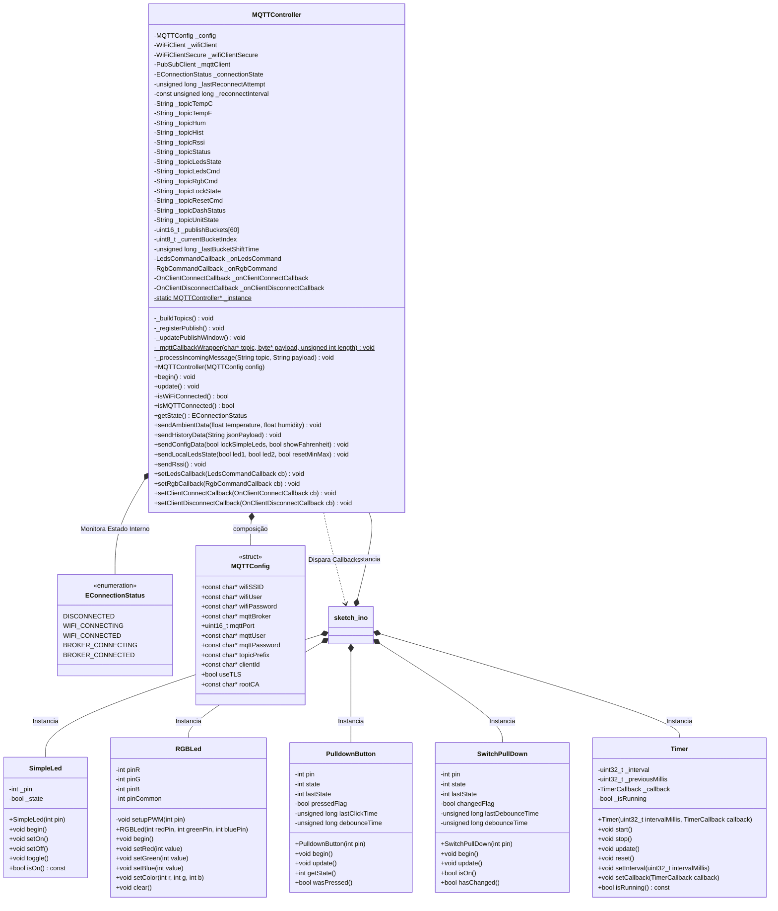

# Sistema de Monitoramento Ambiental e Controle de Atuadores com ESP32 e MQTT
### Disciplina de Tópicos Especiais em Computação - Universidade Federal da Fronteira Sul (UFFS)

**Estudante**: Eduardo Fiorentin
**Opção escolhida**: MQTT (Hivemq)


---

## 1. Introdução
Este projeto documenta o desenvolvimento e a implementação de uma aplicação completa de telemetria ambiental e controle atuado distribuído. Ela é composta por um nó de borda baseado no microcontrolador ESP32 e uma aplicação cliente web construída sob o paradigma de componentes reativos.

A arquitetura de software proposta é uma topologia orientada a eventos (*Event-Driven Architecture*) utilizando o protocolo MQTT (*Message Queuing Telemetry Transport*). Essa escolha reduz o acoplamento entre produtores e consumidores de dados, garantindo que o sistema funcione de forma continua em ambientes de rede local ou remota.

---

## 2. Objetivo
O objetivo principal deste projeto é converter e expandir um sistema embarcado de monitoramento local anterior (baseado em BLE) em uma plataforma conectada à rede via Wi-Fi em modo Estação (STA). O sistema atende aos seguintes requisitos técnicos:

1. **Telemetria Assíncrona e Controle Remoto:** Viabilizar a coleta periódica de variáveis climáticas (temperatura e umidade via sensor DHT22) e dados de infraestrutura de rede (intensidade de sinal RSSI), permitindo paralelamente o controle de atuadores locais (dois LEDs simples e um LED RGB) via interface web.
2. **Persistência de Histórico em Janela Deslizante:** Implementar uma estrutura de dados em memória local no microcontrolador que registre o comportamento ambiental da última hora sem gerar fragmentação de memória (*heap exhaustion*).
3. **Segurança de Borda:** Implementar uma camada de segurança de transporte (TLS/SSL) que permita o tráfego seguro de credenciais e telemetria através de servidores de nuvem públicos.
4. **Interface Reativa do Usuário:** Construir um *Dashboard Web* que consuma o fluxo de dados de telemetria via *WebSockets*, gerando visualizações gráficas de temperatura, umidade, conexão e controle de atuadores.

---

## 3. Explicação Básica do Funcionamento

O ecossistema opera em três camadas principais: o ***Hardware***, o ***Broker MQTT*** e a **Interface Web (*Dashboard*)**.

```
+-----------------+              +--------------------+              +--------------------------+
|     ESP32       |  MQTT (TCP)  |    Broker MQTT     |  WebSockets  |   Dashboard Web          |
|                 | -----------> | privado: Mosquitto | -----------> |   React + Vite           |
| Sensor+Atuadores| <----------- | publico: HiveMQ    | <----------- |  Gráficos + controles    |
+-----------------+              +--------------------+              +--------------------------+
```

### O Fluxo de Dados:
1. **Coleta e Transmissão:** O ESP32 lê periodicamente as variáveis do sensor de temperatura e umidade DHT22. Ele empacota essas informações e as publica no Broker MQTT em tópicos específicos listados mais adiante na seção 5. O ESP32 também monitora o nível de recepção do sinal Wi-Fi (RSSI) e a quantidade de dados transmitidos.
2. **Distribuição Centralizada:** O Broker MQTT atua como um intermediário central. Ele recebe as mensagens publicadas pelo ESP32 e repassa esses pacotes de dados instantaneamente para todos os clientes que se inscreveram para ouvir aqueles tópicos.
3. **Renderização Visual e Comando:** O *Dashboard* construído em *React* se inscreve para ouvir todas as publicações do ESP32. No instante em que um dado de temperatura chega ao *Broker*, ele é enviado ao navegador via *WebSockets*. A interface do *React* recebe o pacote e atualiza imediatamente o display digital ou as linhas dos gráficos na tela do usuário, sem a necessidade de atualizar a página. O caminho inverso ocorre quando o usuário clica em um botão na tela: o *Dashboard* publica um comando, o *Broker* direciona ao ESP32 e a placa (já inscrita nos tópicos específicos) reage de acordo.


---

## 4. Explicação Detalhada do Funcionamento

### 4.1. O Firmware Embarcado (ESP32)

O código fonte do firmware foi projetado evitando ao máximo o uso de chamadas bloqueantes. O agendamento de tarefas é gerenciado por uma abstração de classe `Timer`, baseada na contagem interna de milissegundos da CPU (`millis()`).

#### Máquina de Estados de Conexão Não-Bloqueante:
A gerência de rede está encapsulada na classe `MQTTController`. Ela implementa um ciclo interno controlado por uma Máquina de Estados Finitos (`EConnectionStatus`) composta por cinco estágios auto-recuperáveis:
* `DISCONNECTED`: Estado inicial de repouso ou pós-falha. Dispara a tentativa de associação ao ponto de acesso (roteador local).
* `WIFI_CONNECTING`: Avalia o progresso da conexão do rádio Wi-Fi. Possui um verificador de tempo de 10 segundos para prevenir travamentos caso o roteador esteja offline. Se o tempo expirar, a conexão é reiniciada.
* `WIFI_CONNECTED`: Estado assumido assim que o chip obtém um endereço IP válido na rede local, direcionando o fluxo para a camada de aplicação.
* `BROKER_CONNECTING`: Período em que o cliente TCP tenta estabelecer conexão (*handshake*) com o *Broker* MQTT. Neste ponto, é configurado o recurso **LWT (Last Will and Testament)**, onde o ESP32 registra no Broker um comando para, caso a placa perca conexão sem desconectar formalmente ("testamento"), o próprio Broker publicará um aviso com a string `"offline"`, também com flag de retenção ativa no tópico de status. Desta forma, quando qualquer cliente conectar, saberá imediatamente se o produtor (ESP32) está ou não conectado. Esta é a única chamada bloqueante do sistema, e gera bloqueios enquanto espera resposta do broker. Para amenizar a situação, o tempo de timeout foi configurado para 5 segundos, evitando bloqueio das demais funcionalidades por muito tempo.
* `BROKER_CONNECTED`: Estado de operação. Neste nível, o ESP32 assina de forma ativa os tópicos de controle externo vindo do *Dashboard* (`leds/comando`, `rgb/comando`, `controle/reset`) e chama continuamente a função `_mqttClient.loop()` para esvaziar os buffers de recepção de dados.

#### Estrutura de Dados do Histórico (HistoryBuffer):
Para atender ao requisito de persistência local da última hora de amostragem, a implementação baseou-se em uma classe de Fila Circular (`HistoryBuffer`) estática de tamanho fixo de 60 posições (`HISTORY_SIZE = 60`). 

A amostragem ocorre a cada 1 minuto (`#define   HISTORY_SEND_INTERVAL                           60000 // ms`). Quando a fila atinge sua capacidade máxima (60 amostras = 1 hora), a lógica de controle faz com que o ponteiro de escrita (`_head`) se sobreponha de forma circular ao ponteiro do dado mais antigo (`_tail`), mantendo uma janela deslizante contínua. 

Diferente de estruturas de dados tradicionais onde a leitura destrói o dado (`dequeue`), foi desenvolvido o método `getHistoryJSON()`. Ele varre a memória de forma linear a partir do índice `_tail` atualizado e serializa uma String JSON bruta diretamente em memória, gerando uma estrutura compacta: `{"temp":[24.5, 25.1, ...], "hum":[50.2, 49.8, ...]}`. Para permitir o envio de uma string desse tamanho, o buffer interno padrão de pacotes da biblioteca `PubSubClient` foi configurado para **1024 bytes** via `setBufferSize(1024)` durante a inicialização do controlador.

#### Criptografia TLS/SSL e Sincronismo de Tempo:
Ao acionar o perfil de produção em nuvem pública, a classe `MQTTController` desvia o tráfego do cliente básico TCP para o objeto `WiFiClientSecure`. 

O certificado necessário da autoridade certificadora do servidor (`hivemq_root_ca`) deve ser adicionado a um arquivo `Certificate.h` na raiz do `sketch` seguindo a estrutura exemplo em `Certificate-example.h`. Para evitar a rejeição do certificado devido ao ESP32 inicializar com o relógio interno zerado (ano 1970), o firmware realiza uma chamada à função nativa `configTime()`, que se comunica de forma assíncrona com servidores NTP (`pool.ntp.org`) para buscar e atualizar a hora global logo após a subida do Wi-Fi, validando os limites temporais da chave criptográfica.

#### Organização da operação:

Todo o firmware é separado em classes por responsabilidades. Com isso, promove-se uma boa separação de diferentes lógicas de implementação em locais convenientes e, além disso, a aplicação fica dividida em camadas, facilitando processos de manutenção e substituição de funcionalidades. 

O diagrama de classes abaixo descreve as interfaces implementadas para cada camada: 




---

### 4.2. O Dashboard Web - React + Vite

A aplicação de front-end foi estruturada utilizando o Vite como empacotador e o React como motor de renderização baseada em estados. O grande desafio na arquitetura do React foi isolar a persistência do fluxo assíncrono do MQTT dos ciclos de re-renderização que o framework executa na interface visual.

#### Isolamento de Instância MQTT via useRef:
Para contornar o comportamento do *React* de recriar e re-executar o controlador de efeito (`useEffect`), a instância do cliente de rede gerada pela biblioteca `mqtt.js` foi isolada utilizando referência persistente `useRef(null)`. O `clientRef.current` garante que a conexão com o servidor WebSocket permaneça única e imutável durante toda a sessão do usuário, eliminando conexões fantasmas paralelas e vazamento de memória.

#### Janela Deslizante de Tráfego no Cliente (Requisito de Notificações):
Para atender ao requisito do display numérico que contabiliza as notificações recebidas nos últimos 60 segundos, foi implementado um sistema de medição baseado em tempo absoluto. Ao invés de confiar em uma contagem enviada pela placa, como era na implementação anterior com BLE (que mascararia dados perdidos por instabilidade na rede), nesta implementação o próprio *Dashboard* faz o monitoramento do trafego. 

Sempre que qualquer mensagem chega no barramento do *WebSocket*, o *listener* captura o evento e adiciona um *timestamp* numérico em milissegundos (`Date.now()`) dentro de uma matriz de estado (`msgTimestamps`). Paralelamente, um temporizador reativo, a cada intervalo de um segundo (`setInterval`), varre a matriz filtrando os registros por tempo.

Qualquer registro que possua uma idade superior a 60.000 milissegundos é removido da memória do navegador de forma assíncrona. O tamanho dinâmico dessa matriz (`msgTimestamps.length`) é renderizado reativamente na tela do usuário, gerando um contador de tráfego de rede dinâmico.

---

## 5. Estrutura de Dados e Roteamento (Tópicos MQTT)

A tabela abaixo descreve o dicionário de tópicos do projeto, mapeando o fluxo de dados conformidade com os requisitos de entrega. O prefixo base configurado e utilizado em produção é `uffs/EduardoFioretin/dev`. Para simplificar a tabela, o prefixo é representado por PREFIXO.

| Tópico MQTT | Direção | Tipo de Dado | Descrição e Comportamento Operacional |
| :--- | :--- | :--- | :--- |
| `PREFIXO/temperatura/celsius` | ESP32 &rarr; Nuvem | `String / Float` | Publica a leitura de temperatura atual do sensor DHT22 em graus Celsius. Atualizado a cada 5 segundos. |
| `PREFIXO/temperatura/fahrenheit` | ESP32 &rarr; Nuvem | `String / Float` | Publica a conversão da leitura ambiental para graus Fahrenheit. Utilizado para sincronização de exibição de gráficos de eixos duplos. |
| `PREFIXO/umidade` | ESP32 &rarr; Nuvem | `String / Float` | Transmite a umidade relativa do ar atual medida em porcentagem. |
| `PREFIXO/rssi` | ESP32 &rarr; Nuvem | `String / Integer` | Publica a intensidade do sinal Wi-Fi (dBm) capturada diretamente pelo rádio. Alimenta o gráfico de qualidade de conexão de 60 segundos. |
| `PREFIXO/status` | ESP32 &rarr; Nuvem | `String` | Status de presença na rede. Envia `"online"` ao inicializar. Caso o hardware caia abruptamente, o Broker injeta `"offline"` via LWT (*Last Will*). |
| `PREFIXO/leds/estado` | ESP32 &rarr; Nuvem | `String` | String de feedback de hardware. Formato estruturado por vírgula: `<LED1>,<LED2>` (ex: `"1,0"`). Atualiza o estado visual dos switches da Web. |
| `PREFIXO/controle/bloqueio` | ESP32 &rarr; Nuvem | `String / Boolean`| Estado da chave física de segurança SW1. Transmite `"1"` para indicar que o controle via aplicativo web está bloqueado localmente. |
| `PREFIXO/historico` | ESP32 &rarr; Nuvem | `String / JSON` | String serializada gerada pela Fila Circular contendo as duas matrizes do comportamento de temperatura e umidade da última hora. Publicado a cada 1 minuto. |
| `PREFIXO/leds/comando` | Nuvem &rarr; ESP32 | `String` | Envia comandos de ativação de atuadores simples. Segue o formato `<LED1>,<LED2>` (ex: `"1,1"`). Ignorado pelo firmware se a chave SW1 estiver ativa. |
| `PREFIXO/rgb/comando` | Nuvem &rarr; ESP32 | `String` | Envia os valores de modulação por largura de pulso (PWM) para a cor do LED RGB. Formato estruturado: `<R>,<G>,<B>` (valores de 0 a 255). |
| `PREFIXO/controle/reset` | Nuvem &rarr; ESP32 | `String / Integer` | Injeta o valor `"1"` no tópico para forçar o ESP32 a limpar seus registros históricos locais de máximas e mínimas. |
| `PREFIXO/controle/unidade` | ESP32 &rarr; Nuvem | `String / Integer` | Injeta o valor `"0"` no tópico para exibir grafico em graus Celcius / `"1"` para Fahrenheit . |
| `PREFIXO/dashboard/status` | Nuvem &rarr; ESP32 | `String / Integer` | Status de conexão da dashboard no broker. Envia `"online"` ao conectar e configura o broker para injetar `"offline"` via LWT (*Last Will*) caso a conexão caia abruptamente. |

---

## 6. Configuração de Perfis de Build e Execução

O firmware possui uma diretiva de pré-processador no cabeçalho do firmware que altera os drivers e bibliotecas de conexão de forma estática. A escolha do perfil é feita alterando a macro no topo do arquivo principal:

```cpp
#define PUBLIC_BROKER true
```
- **`PUBLIC_BROKER true`**: ESP32 se conecta ao broker público HiveMQ, com conexão protegida (TLS/SSH). Necessário configurar certificado CA como descrito abaixo.
- **`PUBLIC_BROKER false`**: ESP32 se conecta ao broker local Mosquitto, sem conexão protegida. Necessário configurar broker local, como descrito abaixo. 

Antes de qualquer coisa, deve-se adicionar à estrutura do projeto os arquivos de configuração enviados separadamente na entrega (ou criá-los e preencher de acordo com seus respectivos arquivos de exemplo no repositório - ex: criar `env.h` -> pegar a estrutura do arquivo em`env-example.h` e preenche-la em `env.h`): 

- `env.h`: adicionar à raiz do diretório `sketch`.
- `Certificate.h`: adicionar à raiz do diretório `sketch`.
- `.env`: adicionar à raiz do diretório `dashboard`.


A seguir, cada perfil de conexão é detalhado.

### 6.1. Execução sob Perfil Local (`PUBLIC_BROKER false`)

O perfil local opera através de um container Docker rodando um Broker Eclipse Mosquitto. Para utilizar, primeiramente, verifique se a ferramenta Docker está instalada.

As subpastas usadas para gerenciamento do broker são listadas abaixo:
```
mqtt/
├── config/                   # Arquivos de configuração do Broker
│   ├── mosquitto.conf        # Configuração global e listeners
│   ├── passwd                # usuarios e senhas
│   └── acl.conf              # Regras de permissão por usuário (Autorização)
├── data/                     # Banco de dados persistente das mensagens (.db)
└── log/                      # Arquivos de log de auditoria de rede
```

Os arquivos de configuração do broker já são fornecidos no diretório `broker/mqtt/config`. 

O arquivo `passwd` traz dois usuários pré-configurados para uso:
- **user=admin, senha=admin**: Permissão para publicação e inscrição. 
- **user=sass, senha=sass**: Permissão apenas para inscrição.
As permissões de usuário podem ser alteradas no arquivo `acl`.

Para iniciar o broker (linux), com um terminal acessando o diretório `broker`, execute o seguinte comandos:

```Bash
chmod +x ./setup.sh && ./setup.sh
```

A primeira parte confere permissão de execução ao script `setup.sh`, e a segunda executa o script. Este, por sua vez, criará um container docker com uma instância do *Eclipse Mosquitto*, e fará o mapeamento das portas 1883 e 9001 do container para as respectivas portas do host (que devem estar liberadas). 

Lembre também de configurar a aplicação *dashboard* para acessar o broker local, alterando o objeto de configuração em `App.jsx` para: 

```JavaScript
const broker_url = import.meta.env.VITE_MQTT_URL_LOCAL;
const mqtt_options = {
  username: 'admin',
  password: pass_local,
  clientId: 'ReactDash_' + Math.random().toString(16).substr(2, 8),
};
```

Por fim, verifique se as variáveis nos arquivos `.env` e `env.h` estão corretamente configuradas: 
- Em `.env`:
  - `VITE_MQTT_URL_LOCAL` deve seguir o formato `ws://<ip local da máquina rodando o broker>:9001`
  - `VITE_MQTT_PASS_LOCAL` deve conter a senha do usuário do mqtt configurada no arquivp `passwd`.

- Em `env.h` (configuração do firmware):
  - `WIFI_SSID`: Nome da rede à qual o broker foi exposto.
  - `WIFI_PASS`: Senha da rede.
  - `BROKER_ADDRS_LOCAL`: Ip local da máquina rodando o broker
  - `WIFI_USER`: Usuário na rede (necessário para conexões WAP2)
  - `MQTT_PORT_LOCAL`: 1883
  - `MQTT_USER_LOGIN_LOCAL`: usuário configurado no broker (padrão=admin)
  - `MQTT_USER_PASS_LOCAL`: senha do usuário (padrão=admin)
  - `MQTT_TOPIC_PREFIX`: "uffs/EduardoFioretin/dev/"
  - `MQTT_ESP_CLIENT_ID`: "ESP32_Client" ou qualquer outro nome


No diretório `broker`, há também outros scripts que podem ser usados para interação com o broker: 
- `shell_pub.sh`: Publica uma mensagem no broker (configurar tópico e mensagem no script).
- `shell_sub.sh`: Se inscreve e monitora todos os tópicos.
- `shutdown.sh`: Para e remove container do broker.

Antes de executar cada script pela primeira vez, é necessário conceder permissão de execução:
```bash
chmod +x <nome_script>
``` 

### 6.2. Execução sob Perfil em Nuvem (PUBLIC_BROKER true)
O perfil de produção conecta o sistema embarcado a um cluster seguro na infraestrutura do HiveMQ Cloud.

1. Configuração do Firmware (ESP32):

A porta utilizada deve ser a 8883 (padrão mundial para MQTT sobre TLS). O objeto de configuração exige o preenchimento das credenciais de acesso do broker (`env.h`) e a inclusão do certificado raiz contido em `Certificado.h` (incluídos no zip de entrega).

2. Configuração do Dashboard (React):

O navegador exige o protocolo seguro de WebSockets (`wss://`) operando na porta dedicada 8884:

Em `App.jsx`, utilizar o trecho: 

```JavaScript
const broker_url = import.meta.env.VITE_MQTT_URL_PUBLIC;
const mqtt_options = {
  username: user_public,
  password: pass_public,
  clientId: 'ReactDash_' + Math.random().toString(16).substr(2, 8)
};
```

Antes de acessar, verifique a conformidade das variáveis de ambiente:
- Em `.env`:
  - `VITE_MQTT_USER_PUBLIC` deve conter o nome de usuário configurado no broker.
  - `VITE_MQTT_PASS_PUBLIC` deve conter a senha do usuário.
  - `VITE_MQTT_URL_PUBLIC`  deve conter a url do broker.

- Em `env.h` (configuração do firmware):
  - `WIFI_SSID`: Nome da rede à qual o ESP32 deve se conectar.
  - `WIFI_PASS`: Senha da rede.
  - `BROKER_ADDRS_PUBLIC`: Ip local da máquina rodando o broker
  - `WIFI_USER`: Usuário na rede (necessário para conexões WAP2, caso contrário deixar vazio)
  - `MQTT_PORT_PUBLIC`: 8883
  - `MQTT_USER_LOGIN_PUBLIC`: usuário configurado no broker
  - `MQTT_USER_PASS_PUBLIC`: senha do usuário
  - `MQTT_TOPIC_PREFIX`: "uffs/EduardoFioretin/dev/"
  - `MQTT_ESP_CLIENT_ID`: "ESP32_Client_<\hash>" ou qualquer outro nome

## 7. Limitações Encontradas

Durante o processo de engenharia e integração das duas camadas de software, foram mapeadas as seguintes restrições tecnológicas:

- **Gargalo de Buffer Padrão (`PubSubClient`)**: A limitação nativa da biblioteca de C++ de truncar strings maiores que 256 bytes representou um desafio silencioso na transmissão do histórico, sendo necessária a intervenção manual em tempo de execução via código para expandir a alocação de memória da biblioteca para 1024 bytes.

- **Latência de Handshake TLS no ESP32**: Devido ao custo computacional da criptografia asimétrica processada em um chip microcontrolado, a conexão inicial sob o perfil `PUBLIC_BROKER true` apresenta uma latência perceptível de 1.5 a 2.5 segundos para conexão, comparado ao tempo quase instantâneo do tráfego local em TCP puro.


- **Instabilidade Intrínseca de Conexões em Nuvem Gratuita**: Observou-se que *Brokers* públicos gerais e clusters gratuitos impõem limites agressivos de taxa de mensagens (*Rate Limiting*). O design do firmware contornou essa limitação segregando a taxa de publicação: telemetria rápida a cada 5 segundos e o pacote denso do histórico apenas a cada 60 segundos, mantendo o consumo de banda de rede dentro das margens seguras das diretrizes de uso livre da nuvem.
